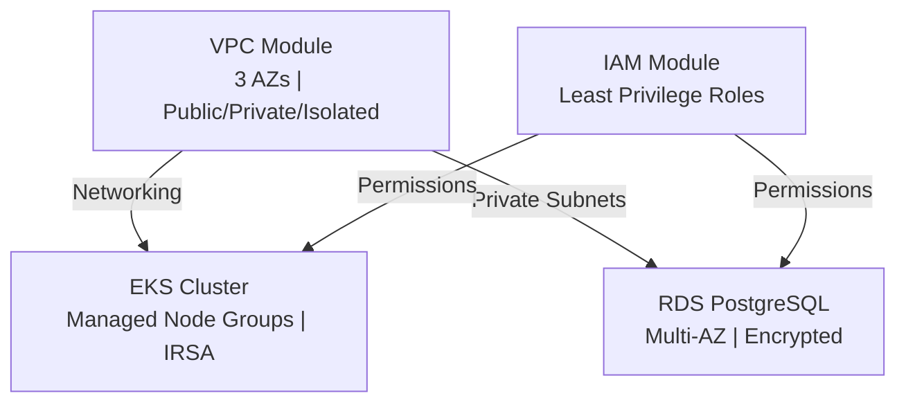

# AWS Infrastructure as Code (Terraform)

Production-grade multi-account AWS infrastructure using Terraform. Designed for high-availability, cost optimization, and operational excellence.

## Architecture Overview



## What This Provisions

- **VPC**: 3-AZ high-availability network with public, private, and isolated subnets. NAT gateways for egress, VPC Flow Logs for monitoring
- **EKS**: Kubernetes cluster with mixed spot/on-demand node groups, cluster autoscaler, AWS Load Balancer Controller, encryption at rest
- **RDS**: PostgreSQL database with Multi-AZ failover, automated backups, encryption, enhanced monitoring
- **IAM**: Role-based access with least-privilege policies for all AWS service principals

## Design Decisions

See [ADR](./ADR/) for detailed rationales:
- **terraform-over-cdk.md**: Why Terraform enables better multi-team collaboration and auditing
- **eks-over-ecs.md**: EKS chosen for workload flexibility and Kubernetes ecosystem benefits
- **multi-account-strategy.md**: Account separation for blast radius containment and billing isolation

## Cost Estimates (Monthly, us-east-1)

| Component | Est. Cost |
|-----------|-----------|
| EKS Cluster | $73 |
| NAT Gateway (3x) | $135 |
| RDS Multi-AZ (db.t3.medium) | $380 |
| Data Transfer | $50 |
| **Total** | **~$640** |

Production workloads will scale accordingly. Use `terraform plan` to see exact estimates for your environment.

## Prerequisites

- Terraform >= 1.0
- AWS CLI v2 configured with credentials
- Appropriate IAM permissions (see [bootstrap](./bootstrap/))

## Deployment

### First Time: Bootstrap Remote State

```bash
cd bootstrap
terraform init
terraform apply -auto-approve
# Note the S3 bucket name and DynamoDB table name from outputs
```

### Deploy Infrastructure

```bash
cd environments/prod
terraform init -backend-config="bucket=YOUR_BUCKET_NAME" \
               -backend-config="dynamodb_table=terraform-lock"
terraform plan
terraform apply
```

### Using GitHub Actions

Push to `main` branch. CI/CD pipeline will:
1. On PR: Run `terraform fmt`, `validate`, and `plan` with PR comment
2. On merge: Run `terraform apply`

See [.github/workflows/terraform-ci.yml](.github/workflows/terraform-ci.yml) for details.

## Module Outputs

Each environment outputs cluster endpoint, RDS endpoint, security group IDs, and IAM role ARNs. Reference via:

```bash
terraform output -json
```

## Monitoring & Logging

- **VPC Flow Logs**: Sent to S3, queryable via Athena
- **EKS Logs**: Control plane logs streamed to CloudWatch
- **RDS Enhanced Monitoring**: OS metrics to CloudWatch
- **Tags**: All resources tagged with Environment, Owner, Cost Center for billing attribution

## Support & Questions

See [docs/architecture.md](./docs/architecture.md) for deeper component details.
