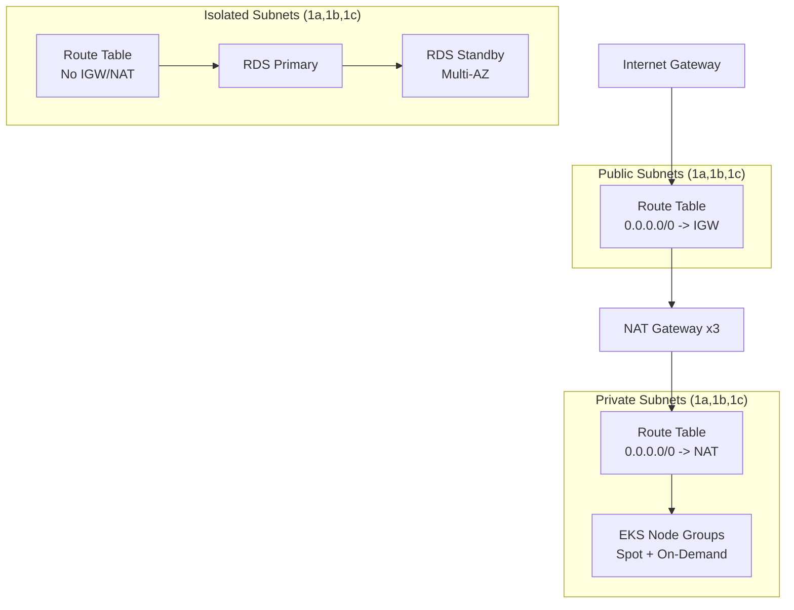
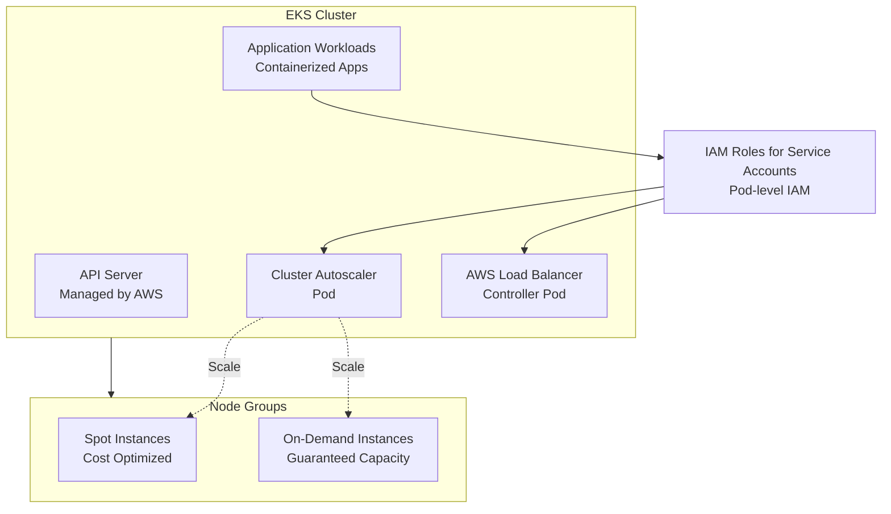
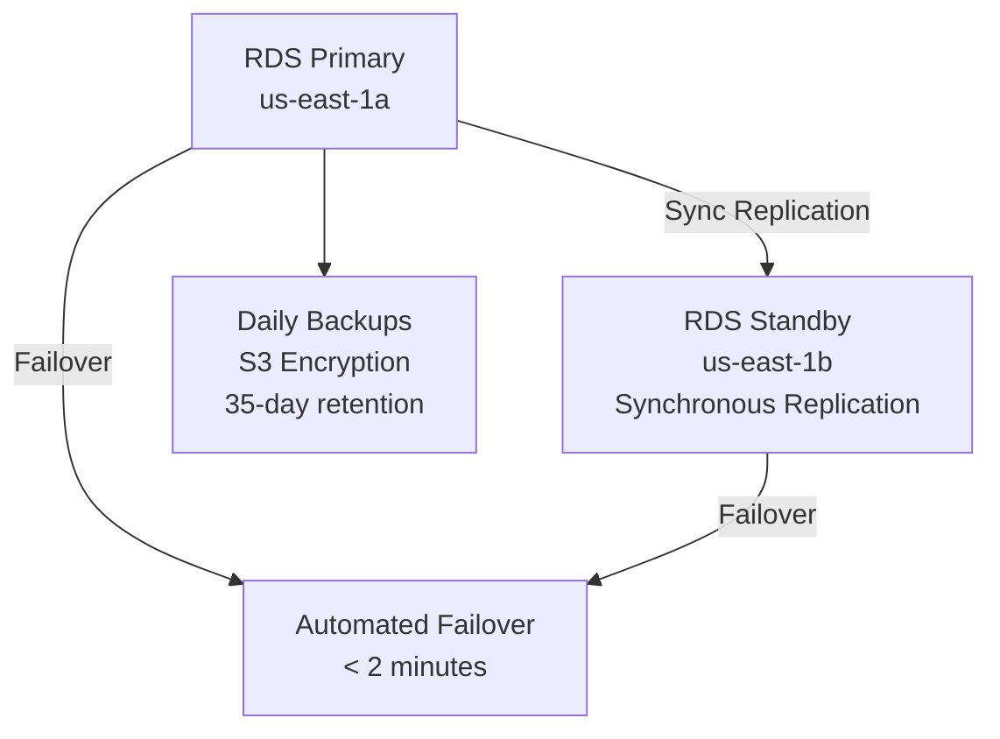

# Architecture Documentation

## System Overview

This infrastructure provisions a production-grade AWS environment with:
- **VPC**: Multi-AZ networking with public, private, and isolated subnets
- **EKS**: Kubernetes cluster for containerized workloads
- **RDS**: Managed PostgreSQL database with high availability
- **IAM**: Least-privilege roles and policies for all components

## Network Architecture



### VPC Module Components

- **CIDR**: 10.0.0.0/16 (configurable)
- **Availability Zones**: 3 zones (us-east-1a/b/c)
- **Public Subnets**: 10.0.1.0/24, 10.0.2.0/24, 10.0.3.0/24
- **Private Subnets**: 10.0.11.0/24, 10.0.12.0/24, 10.0.13.0/24
- **Isolated Subnets**: 10.0.21.0/24, 10.0.22.0/24, 10.0.23.0/24

### VPC Flow Logs

VPC Flow Logs sent to S3 for network forensics and troubleshooting:
- Enabled for all ENIs
- 1-minute aggregation interval
- Stored in S3 with partitioning by date
- Queryable via AWS Athena

## EKS Architecture



### EKS Configuration

- **Cluster Version**: 1.27+ (configurable)
- **Endpoint Access**: Public + Private (configurable)
- **Encryption**: KMS-backed envelope encryption for secrets
- **Logging**: Control plane logs to CloudWatch
- **Node Groups**:
  - **Spot**: t3.medium/large (cost optimized, 60% discount)
  - **On-Demand**: t3.medium/large (guaranteed capacity)
- **IRSA**: Enabled for pod-level IAM permissions
- **Managed Add-ons**: vpc-cni, kube-proxy, coredns

### IAM Roles for Service Accounts (IRSA)

Enables fine-grained permissions for Kubernetes pods:

```yaml
cluster-autoscaler:
  - autoscaling:DescribeAutoScalingGroups
  - autoscaling:SetDesiredCapacity
  - ec2:DescribeImages
  - ec2:DescribeLaunchTemplateVersions

aws-load-balancer-controller:
  - ec2:DescribeSecurityGroups
  - elasticloadbalancing:DescribeLoadBalancers
  - elasticloadbalancing:DescribeTags
  - elasticloadbalancing:DescribeTargetGroups
```

## Database Architecture



### RDS Configuration

- **Engine**: PostgreSQL 15.x
- **Instance Class**: db.t3.medium (configurable, production: db.r5.xlarge+)
- **Multi-AZ**: Enabled for automatic failover
- **Storage**: 20GB gp3 SSD (configurable)
- **Backup**:
  - Automated backups: 35 days retention
  - Backup window: 03:00-04:00 UTC
  - Copy-to-region: Enabled for disaster recovery
- **Encryption**:
  - At-rest: AES-256 with AWS-managed KMS key
  - In-transit: TLS 1.2
- **Monitoring**:
  - Enhanced monitoring every 60 seconds
  - Performance Insights enabled
  - Slow query logs to CloudWatch
- **Parameters**:
  - max_connections: 100 (SERVERLESS_PARAMETER_GROUP)
  - shared_preload_libraries: pg_stat_statements
  - log_min_duration_statement: 1000ms

## Security & Compliance

### Encryption

- **VPC**: VPC Flow Logs encrypted in S3
- **EKS**: Secrets encrypted at rest with KMS
- **RDS**: Data encrypted at rest and in transit
- **EBS**: Volumes encrypted by default

### IAM Least Privilege

- EKS nodes: Only autoscaling and EC2 describe permissions
- RDS: No direct IAM access (managed via SecurityGroup)
- VPC Flow Logs: Only S3 PutObject to dedicated bucket
- All roles include explicit Deny for dangerous actions

### Tagging Strategy

All resources tagged with:
- **Environment**: dev | prod
- **Owner**: team-name
- **CostCenter**: cost-center-id
- **Terraform**: true
- **ManagedBy**: terraform
- **CreatedAt**: date
- **Project**: project-name

Tags enable:
- Cost allocation and chargeback
- Resource filtering and lifecycle
- Automated backup and cleanup policies
- Compliance auditing

## Monitoring & Observability

### CloudWatch Metrics

- **EKS**: Node CPU, memory, network, disk utilization
- **RDS**: CPU, connections, IOPS, storage space
- **VPC**: Network packets, bytes, rejected connections

### Logs

- EKS control plane logs: Cluster, Audit, Authenticator, API Server
- RDS logs: PostgreSQL logs, slow query logs
- VPC Flow Logs: Network traffic analysis via Athena

### Cost Monitoring

- AWS Cost Explorer: Spend by service, tag, account
- AWS Budgets: Alerts for cost anomalies
- Compute Optimizer: Right-sizing recommendations

## Disaster Recovery

- **RTO**: 2 minutes (Multi-AZ failover)
- **RPO**: Synchronous replication (0 data loss)
- **Backup**: Daily snapshots retained 35 days
- **Cross-region**: Backup copies to secondary region
- **Testing**: Monthly failover drills

## Scaling Strategy

### Horizontal Pod Autoscaling (HPA)

Managed via Kubernetes HPA manifests (separate repo):
- Target CPU utilization: 70%
- Min replicas: 2, Max: 10

### Cluster Autoscaling

Cluster Autoscaler pod monitors:
- Pending pods
- Node utilization
- Autoscaling group capacity

Automatically adds/removes nodes within limits:
- Min: 3 nodes (1 per AZ)
- Max: 20 nodes (configurable)
- Prefers spot instances for cost optimization

### RDS Scaling

Manual scaling for predictable workloads:
- Storage: Auto-grow enabled (max 1000GB)
- Instance class: Scale up during peak hours
- Replicas: Add read replicas for reporting queries

## Cost Optimization

| Component | Strategy |
|-----------|----------|
| EC2 Instances | 70% spot, 30% on-demand mix |
| NAT Gateway | 1 NAT per AZ (required for HA) |
| RDS | t3.medium dev (cheaper), r5.xlarge+ prod |
| Data Transfer | Minimize cross-AZ, use VPC endpoints |
| Unused IPs | Elastic IPs auto-released when unused |

Monthly cost typically $640 for dev, $2400+ for prod (with larger RDS instance).

## Runbooks

### Common Operations

**Scale EKS Cluster**
```bash
cd environments/prod
terraform apply -var="desired_capacity=5"
```

**Add RDS Read Replica**
```bash
cd environments/prod
terraform apply -var="create_read_replica=true"
```

**Increase Database Storage**
```bash
cd environments/prod
terraform apply -var="allocated_storage=100"
```

**View All Outputs**
```bash
terraform output -json
```

